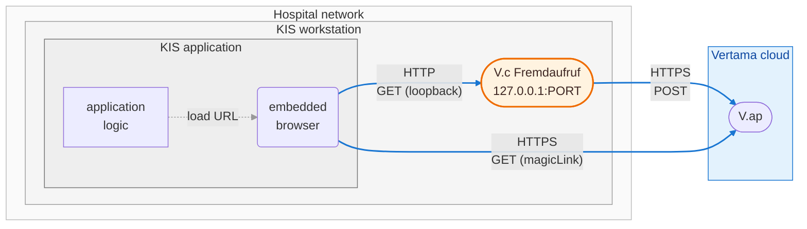
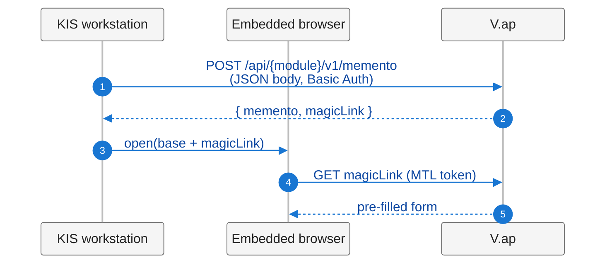
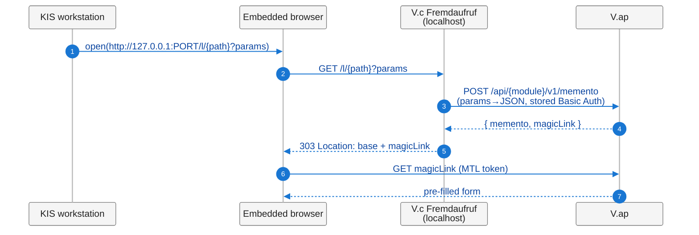
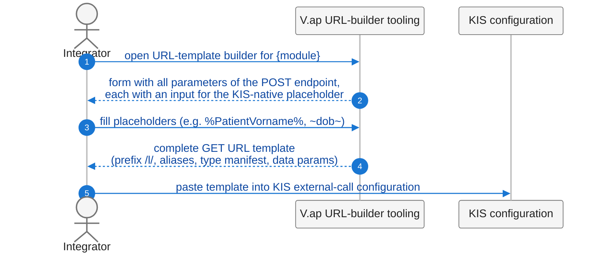

# V.connect Fremdaufruf — Overview

The V.connect Fremdaufruf Service is a small local component that
lets KIS systems initiate a V.ap session — opening a pre-filled
product form (DUBA, ELIM+, …) inside the workstation's browser —
even when the KIS cannot issue an HTTP POST. It runs adjacent to the
KIS, accepts the GET URL the KIS knows how to emit, and bridges to
V.ap's POST-based session-initialisation flow.

This document is the product overview: what Fremdaufruf is for, how
it fits into a hospital's existing KIS + V.ap landscape, and what
adopting it involves. KIS integrators configuring their first
integration start with the [Benutzerhandbuch](user-manual.md). The
full operations manual — installation procedure, configuration
reference, troubleshooting — ships with the binary as the
**Betriebshandbuch** and is reachable from the component's admin
dashboard once installed.

---

## 1. Purpose

V.ap product modules expose POST endpoints that accept structured
JSON data (patient identification, report data, court-message
references, …) and respond with an encrypted `memento` plus a
`magicLink` — an authenticated single-use URL the end user opens in
a browser to land on the pre-filled form.

This flow works for KIS systems that can issue an HTTP POST with a
JSON body, authenticate with Basic Auth, and then open a browser at
the returned URL. Many KIS systems cannot. In particular, some KIS
configurations expose **only a single integration primitive**:
"open this external URL, with these parameters appended to the
query string." No POST verb, no request body, no programmatic
header control.

The naïve adaptation — accept the same payload via GET on a V.ap
endpoint — is rejected for data-protection reasons. URLs leak: into
browser history, into server access logs, into HTTP proxy logs, and
into the `Referer` header of any link the user clicks after landing
on the form. V.ap therefore declines to receive sensitive payload
via GET URLs, on its own endpoints or anywhere else.

A second motivation is UX-shaped. In many of these KIS systems the
"open external URL" primitive specifically uses the KIS's
**embedded browser pane**, which renders the target *inside* the
KIS UI rather than in a separate window. The Fremdaufruf approach
preserves this property end-to-end: the embedded browser issues the
loopback GET, follows the 303 redirect to V.ap, and renders the
pre-filled form inside the KIS — no window switching, no
external-browser handoff, no separate session. A KIS that prefers
to launch an external browser process (its other common option) is
supported by the same flow without changes.

The Fremdaufruf Service closes this gap by intermediating locally
on the KIS side. It runs adjacent to the KIS (per-workstation
localhost in the primary deployment), receives the GET request from
the KIS, performs the actual POST to V.ap on behalf of the KIS, and
returns an HTTP 303 redirect to the resulting `magicLink`. The
browser follows the redirect and reaches the same end state as the
direct-POST case.

The V.ap modules themselves are **unchanged**. The Fremdaufruf
Service is the only addition.

---

## 2. Architecture

### Component topology

The browser shown is the KIS's **embedded browser pane** — the
typical case and the principal UX motivation for this design. The
"load URL" arrow is an in-process instruction inside the KIS
application, not an OS-level launch; the embedded browser then
drives all subsequent HTTP exchanges. A KIS that launches an
external browser process instead follows the same protocol path
with no difference at the wire level — that arrow simply becomes a
process spawn rather than an in-process load.

Beyond KIS and embedded browser, the Fremdaufruf Service (added by
this design) is the only new component on the workstation. It binds
to the loopback interface and is not reachable from outside the
workstation.

Two HTTPS sessions cross the boundary between the Hospital network
and the Vertama cloud: the component's POST to V.ap (carrying the
patient payload and using the stored API-user credentials), and the
browser's subsequent GET of the `magicLink` to obtain the
pre-filled form. No other Vertama-cloud traffic originates from
the workstation in this flow.

Admin tooling for generating URL templates lives in V.ap itself; it
is not depicted here because it is not part of the runtime path.

### Runtime flow — baseline (POST-capable KIS, for reference)

### Runtime flow — with V.connect Fremdaufruf (GET-only KIS)

The only addition is the local component between browser and V.ap.
The KIS-opens-browser step and the final magic-link GET are
identical to the baseline.

### Admin-config flow

The URL template is constant across workstations. An integrator
generates it once per module and per KIS placeholder convention,
then pastes it into every KIS that should expose the integration.
The full integrator-facing walkthrough is in the
[Benutzerhandbuch](user-manual.md).

### Responsibility split

| Concern                                | Owner                       |
|----------------------------------------|-----------------------------|
| Product module endpoints, OpenAPI      | V.ap (unchanged)            |
| URL-template builder UI                | V.ap                        |
| Placeholder substitution at run time   | KIS (existing mechanism)    |
| GET → JSON translation, POST, redirect | Fremdaufruf Service         |
| API-user credentials at rest           | Fremdaufruf Service config  |
| Form rendering, MTL authentication     | V.ap (unchanged)            |

All product-specific knowledge (schemas, field names, required
fields) stays in V.ap. The component carries no module-specific
code.

---

## 3. Deployment model

V1 supports two deployment shapes; both run from the same binary
with different configuration.

**Per-workstation, loopback-bound.** Each KIS workstation runs its
own instance bound to `127.0.0.1`. Trust boundary: the workstation
operating system. Operationally simple — one workstation, one
install — fits when each workstation is a self-contained
integration point. Distributed as a signed Windows installer that
registers a native Windows service.

**Hospital-network-bound (intranet-shared).** A single installation
inside the hospital network, bound to a routable address, serves
many KIS workstations. Trust boundary: a configured **access
secret** that every caller must supply on every request (§5).
Operationally lighter when many workstations need the same
integration. Distributed as a container image at
`ghcr.io/mcp-health/v.connect/fremdaufruf` (linux/amd64), with a
Docker Compose example as a starting point.

Both shapes use the same binary, the same configuration schema,
and the same upstream contract with V.ap. The choice of shape is a
deployment decision, not a product decision.

---

## 4. Tech stack

The component is a **single static binary** (~10 MB), no runtime
dependency on the workstation. Standard-library HTTP server and
client, JSON, TLS — minimal third-party surface. Cross-compiled
from one source tree for Windows, Linux, and macOS. Operates as a
Windows service, as a Linux container, or as a foreground process
during development, without any additional runtime supervisor.
Sub-second startup, single-digit MB resident memory.

---

## 5. Security posture

### Authority model

What can be done through the Fremdaufruf component is governed by
three independent controls:

| Control                                                  | Owner            |
|----------------------------------------------------------|------------------|
| What an API user may do at V.ap                          | Vertama (V.ap)   |
| Which upstream paths this installation may reach         | Hospital admin   |
| Whether a caller is allowed to reach the component       | Hospital admin   |

**V.ap-side authorisation is the primary control.** The configured
API user has a defined scope at V.ap, and what that scope permits
is governed by V.ap's per-API-user authorisation. The component is
not the gatekeeper for which V.ap actions can be performed — V.ap
is.

**Hospital admins may narrow the surface locally** by configuring
an optional path allowlist in the component's configuration. With
the allowlist set, paths outside the list are rejected by the
component (404) before any upstream call is made. Without an
allowlist, all paths the configured API user is V.ap-authorised
for remain reachable.

**For intranet-bound deployments**, every caller must supply a
configured access secret on every request (`_s` URL parameter). On
mismatch the component returns 403 before any upstream call. The
secret is the trust-boundary control for non-loopback deployments,
playing the role the workstation OS plays for loopback ones. The
specific configuration is covered in the **Betriebshandbuch**
shipped with the binary.

### Wire-level guarantees

- **Inbound scope:** the listener binds only to the address
  configured. The component never accepts connections beyond what
  the bind address itself permits.
- **Outbound scope:** HTTPS to the configured V.ap base URL only.
  Other destinations are not reachable from component logic.
- **Credentials:** stored at rest in a file-permission-restricted
  TOML config (or via OS environment variables, for transient
  overrides). Sent only to the configured V.ap base URL over TLS,
  never logged.
- **Audit logging:** every request logs timestamp, target endpoint
  path, parameter count, V.ap status code, and outcome. **Parameter
  values and parameter keys are never logged**, regardless of log
  level — only the count. The configured access secret and any
  `_s` URL parameter value are likewise never logged.
- **TLS:** verification against the system trust store is
  mandatory by default. Disabling verification is permitted only
  for local development against a self-signed V.ap and the
  component emits a startup warning when it is in that mode.
- **Loopback deployment trust boundary:** GET URLs from the KIS to
  the component contain patient data in the URL but travel only
  over loopback, never the network. The trust boundary is the
  workstation OS, the same boundary the KIS itself operates
  within.
- **Intranet deployment trust boundary:** GET URLs traverse the
  hospital network between caller and component. The trust
  boundary is the hospital network plus the access secret; the
  secret travels in the URL alongside the patient data and is
  exposed to whatever observes intranet traffic. As with the
  loopback case, the data-protection improvement is over
  *internet-facing* leakage paths (V.ap server logs, intermediate
  proxy logs, `Referer`) — not over intranet observation.

---

## 6. V1 scope — what's in and what's deferred

**In V1:**

- The component as described above, in both deployment shapes
  (per-workstation loopback and hospital-network intranet).
- TOML configuration with environment variable overrides.
- Signed Windows installer with native Windows service registration.
- Container distribution for Linux deployments at
  `ghcr.io/mcp-health/v.connect/fremdaufruf` (linux/amd64).
- Stderr and file audit-log destinations.
- Browser-based admin dashboard for status, configuration reload,
  and V.ap-connectivity testing.
- The V.ap URL-builder tooling for one or more product modules
  (DUBA available at V1 launch; further modules follow the same
  pattern).

**Deferred to a later iteration:**

- Array-typed parameters in the POST body. No currently shipping
  V.ap module needs them; revisited when one does.
- Signed URL templates (V.ap-issued signature the component
  verifies, so a tampered template is rejected at the component).
- OS credential-store integration (Windows DPAPI / Linux
  secret-tool).
- Syslog and Windows eventlog audit-log destinations.

---

## 7. Adopting Fremdaufruf

### 7.1 Prerequisites

| Item | Requirement |
|------|-------------|
| **Platform** | Windows 10 or later (x64) for per-workstation deployments; Linux x86-64 via container (Docker / Podman) for intranet deployments. macOS is development-only. |
| **Outbound network** | HTTPS reachability from the workstation (or LAN host) to the V.ap base URL. |
| **V.ap API user** | Provisioned by your Vertama contact, with the module scopes the integration requires. |
| **Service-installation rights** | Administrator (Windows) or root (Linux) for service registration. Day-to-day operation runs as an unprivileged service account. |
| **Disk** | Less than 50 MB for the binary, configuration, and audit log. Plan additional capacity if you direct the audit log to a file and operate at high request volume. |

The component is a single static binary with no runtime
dependencies on the workstation — no JRE, no .NET runtime, no
shared libraries beyond the OS itself.

### 7.2 Installation paths

- **Windows.** Signed installer (Vertama-supplied) registers the
  Windows service, drops the binary in `%PROGRAMFILES%`, and writes
  a configuration template to `%PROGRAMDATA%\Vertama\fremdaufruf\`.
  Authenticode signature is verifiable from the file's *Digital
  Signatures* tab before install. Total install time: a few minutes.
- **Linux / container.** Container image at
  `ghcr.io/mcp-health/v.connect/fremdaufruf` (linux/amd64). A
  Docker Compose example is included as a starting point.
  Configuration is supplied via environment variables (12-factor)
  or a mounted config file.
- **macOS.** Development only. No supported production deployment
  channel.

### 7.3 What's involved operationally

Once installed, the component runs as a long-running service and
exposes a browser-based **admin dashboard** at
`http://127.0.0.1:8811/admin` on the host. The administrator sets
the admin access code on first visit, edits the configuration to
point at the customer's V.ap instance, reloads the configuration
from the dashboard, and confirms the V.ap connectivity test passes.
The KIS may then issue requests against the data port.

Day-to-day operation is hands-off. The dashboard shows live activity
counters, a redacted view of the effective configuration, and the
recent request history. Hospital-IT monitoring uses standard service
liveness checks.

The complete operations manual — installation procedure, full
configuration schema, troubleshooting, audit-log details — ships
with the binary as `betriebshandbuch.html` and is reachable from
the admin dashboard. Vertama supplies it on request prior to
deployment for IT-security review.

---

**Companion documents:**

- [Benutzerhandbuch](user-manual.md) — KIS-integrator guide to the
  V.ap URL-builder tooling.

---

**Last updated:** 2026-06-11
**Applies to:** V.connect Fremdaufruf V1
