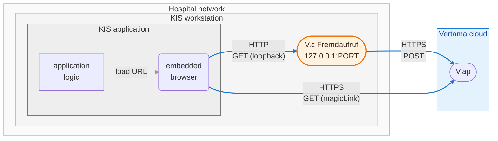
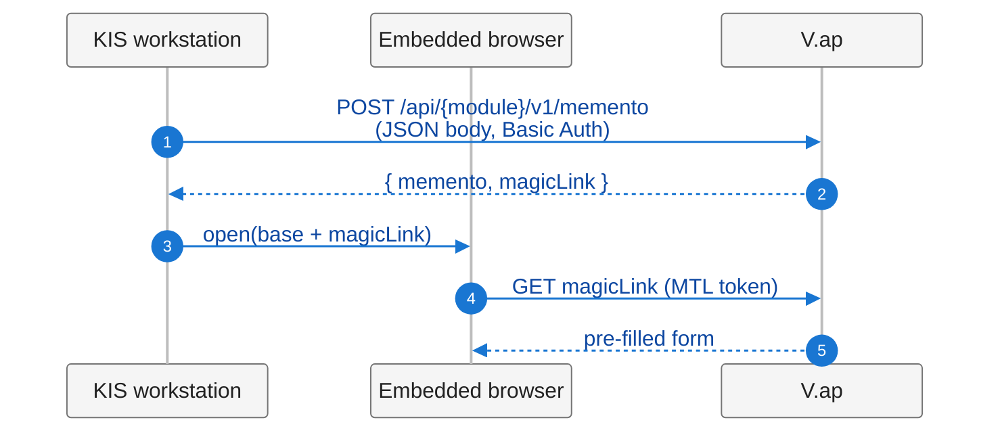
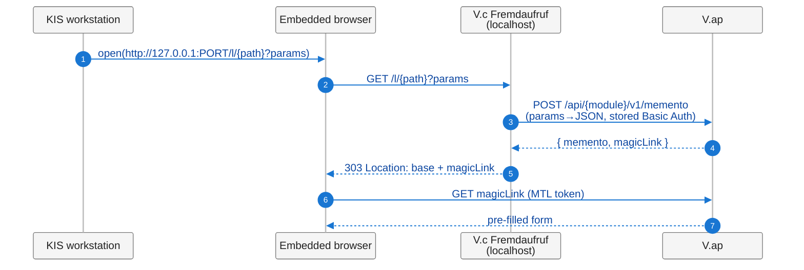
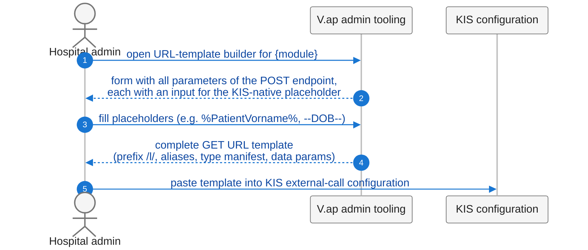

# V.connect Fremdaufruf Service — Solution Outline

*This document is currently available in English only.*

**Working title:** V.connect Fremdaufruf Service
**Status:** Solution outline, iteration 1, for internal alignment ahead of implementation
**Audience:** Vertama engineering and product

This document sketches the design of a small local component that enables
KIS systems limited to GET-only outbound calls to initiate a V.ap session
(currently exemplified by the ELIM+ memento flow) without leaking
sensitive parameters into URLs. It is deliberately not yet a full
specification: enough detail to consent to *what* is being built,
deliberately short of implementation-level minutiae.

---

## 1. Purpose

V.ap product modules expose POST endpoints that accept sensitive payload
(patient identification, laboratory report data, etc.) and respond with
an encrypted `memento` plus a `magicLink` — an authenticated single-use
URL the end user opens in a browser to land on the pre-filled form.
ELIM+ is the worked example throughout this document; the pattern is
module-agnostic.

This flow works for KIS systems that can issue an HTTP POST with a JSON
body, authenticate with Basic Auth, and then open a browser at the
returned URL. Many KIS systems cannot. In particular, some KIS
configurations expose **only a single integration primitive**: "open
this external URL, with these parameters appended to the query string."
No POST verb, no request body, no programmatic header control.

The naïve adaptation — accept the same payload via GET on a V.ap
endpoint — is rejected for data-protection reasons. URLs leak: into
browser history, into server access logs, into HTTP proxy logs, and into
the `Referer` header of any link the user clicks after landing on the
form. V.ap therefore declines to receive sensitive payload via GET URLs,
on its own endpoints or anywhere else.

A second motivation is UX-shaped. In many of these KIS systems the
"open external URL" primitive specifically uses the KIS's **embedded
browser pane**, which renders the target *inside* the KIS UI rather than
in a separate window. The Fremdaufruf approach preserves this property
end-to-end: the embedded browser issues the loopback GET, follows the
303 redirect to V.ap, and renders the pre-filled form inside the KIS —
no window switching, no external-browser handoff, no separate session.
A KIS that prefers to launch an external browser process (its other
common option) is supported by the same flow without changes.

The **V.connect Fremdaufruf Service** closes this gap by intermediating
locally on the KIS side. It runs adjacent to the KIS (per-workstation
localhost in the primary deployment), receives the GET request from the
KIS, performs the actual POST to V.ap on behalf of the KIS, and returns
an HTTP 303 redirect to the resulting `magicLink`. The browser follows
the redirect and reaches the same end state as the direct-POST case.

The V.ap modules themselves are **unchanged**. The Fremdaufruf Service
is the only addition.

## 2. Architecture

### Component topology



The browser shown is the KIS's **embedded browser pane** — the typical
case and the principal UX motivation for this design. The "load URL"
arrow is an in-process instruction inside the KIS application, not an
OS-level launch; the embedded browser then drives all subsequent HTTP
exchanges. A KIS that launches an external browser process instead
follows the same protocol path with no difference at the wire level —
that arrow simply becomes a process spawn rather than an in-process
load.

Beyond KIS and embedded browser, the V.c Fremdaufruf service (added by
this proposal) is the only new component on the workstation. It binds
to the loopback interface and is not reachable from outside the
workstation.

Two HTTPS sessions cross the boundary between the Hospital network and
the Vertama cloud: the component's POST to V.ap (carrying the patient
payload and using the stored API-user credentials), and the browser's
subsequent GET of the `magicLink` to obtain the pre-filled form. No
other Vertama-cloud traffic originates from the workstation in this
flow.

Admin tooling for generating URL templates lives in V.ap as well; it is
not depicted here because it is not part of the runtime path — see the
admin-config sequence diagram below.

### Runtime flow — baseline (POST-capable KIS, shown for reference)



### Runtime flow — with V.c Fremdaufruf (GET-only KIS)



The only addition is the local component between browser and V.ap. The
KIS-opens-browser step and the final magic-link GET are identical to the
baseline.

### Admin-config flow



The URL template is constant across workstations. The admin generates it
once per module and per KIS placeholder convention, then pastes it into
every KIS that should expose the integration.

### Responsibility split

| Concern                                | Owner                       |
|----------------------------------------|-----------------------------|
| Product module endpoints, OpenAPI      | V.ap (unchanged)            |
| Admin URL-template builder UI          | V.ap (new)                  |
| Placeholder substitution at run time   | KIS (existing mechanism)    |
| GET → JSON translation, POST, redirect | Fremdaufruf Service         |
| API-user credentials at rest           | Fremdaufruf Service config  |
| Form rendering, MTL authentication     | V.ap (unchanged)            |

All product-specific knowledge (schemas, field names, required fields,
disease lists) stays in V.ap. The component carries no module-specific
code.

## 3. Component contract

The component is a single executable exposing one HTTP listener and one
forwarding rule. It is module-agnostic: adding a new product module to
V.ap requires no change to the component.

### 3.1 URL scheme

```
GET http://127.0.0.1:PORT/l/<vap-endpoint-path>?<query>
```

- `/l/` is a fixed prefix reserved by the component. All requests not
  matching the prefix return 404.
- `<vap-endpoint-path>` is used verbatim as the path of the V.ap POST
  request. The component performs no validation that the path resolves
  to a known module — V.ap returns 404 if it does not, and the component
  propagates that response.
- `<query>` carries data parameters and reserved meta parameters. Meta
  parameters are distinguished by a leading underscore (`_a`, `_t`).
  All other keys are treated as data parameters.

Two meta parameters are defined; both are optional.

**`_a` — path-segment alias map.** A comma-separated list of
`short:long` pairs that the component expands inside data-parameter
keys, segment by segment.

```
_a=P:Patient,S:Standard,N:Name,M:MeldendeEinrichtung
```

With this map, the data-parameter key `P.S.N.Vorname` expands to
`Patient.Standard.Name.Vorname` before JSON-path reconstruction.

The alias map exists for URL density. KIS workstations and some
intermediate URL handlers impose length limits; the aliases let a
template stay well below those limits even for full-Patient payloads.

**`_t` — type manifest.** A comma-separated list of `path:type` pairs
that override the default string coercion for the named data parameters.

```
_t=P.IsAnonym:b,P.S.Geburtsdatum:d
```

The component applies aliases first (so `P.IsAnonym` is matched against
the expanded JSON path), then coerces.

**Data parameters.** Each non-reserved query key is a dotted JSON path.
After alias expansion, the component reconstructs a nested JSON object
matching the path. Keys with no entry in `_t` are encoded as JSON
strings.

### 3.2 Type coercion

A closed vocabulary of six type kinds is supported. Single-letter codes
are used in `_t`.

| Code      | JSON output type | Accepted input form (after URL decoding)                  |
|-----------|------------------|-----------------------------------------------------------|
| *(none)*  | string           | any                                                       |
| `b`       | boolean          | `true` / `false` (case-insensitive)                       |
| `i`       | integer          | optional `-`, then decimal digits                         |
| `n`       | number           | JSON number syntax (decimal, optional sign, optional `e`) |
| `d`       | string (date)    | ISO 8601 calendar date `YYYY-MM-DD`                       |
| `t`       | string (datetime)| ISO 8601 datetime with timezone offset or `Z`             |

`d` and `t` are sent to V.ap as JSON strings (matching the existing API
contract — V.ap already expects date-shaped strings, not native date
types), but the component validates the shape locally so that template
or placeholder errors surface as a 400 from the component rather than
as an opaque 400 from V.ap.

This vocabulary is a property of JSON + OpenAPI, not of any product
module. New modules can ship with no component change; only the
introduction of a new *type kind* (rare) would require one.

Coercion errors return HTTP 400 from the component without forwarding
to V.ap. The response body names the offending parameter and the
expected kind.

### 3.3 Module mapping (path mirroring)

The component does not maintain a mapping from KIS-side URLs to V.ap
endpoints. It mirrors the path: `/l/<X>` → `POST <vap-base>/<X>`. The
V.ap admin tooling already knows the endpoint path (it has the OpenAPI),
so it can emit the correct `<X>` directly into the URL template.

Practical example (ELIM+):

```
GET  http://127.0.0.1:8810/l/api/elimplus/v1/memento?...
→
POST https://vap.example.com/api/elimplus/v1/memento
```

### 3.4 Response semantics

| Trigger                                   | Component response       | Notes                                                  |
|-------------------------------------------|--------------------------|--------------------------------------------------------|
| Successful POST, V.ap returns 200         | **303 See Other**        | `Location: <vap-base><magicLink>`. Empty body.         |
| Malformed URL, missing required meta      | 400 Bad Request          | Plain-text body identifying the problem.               |
| Type-coercion failure on a data parameter | 400 Bad Request          | Body names parameter and expected kind. No POST issued.|
| V.ap returns 400 (validation)             | 422 Unprocessable Entity | Body propagates V.ap's `errors[]` array.               |
| V.ap returns 401 / 403                    | 502 Bad Gateway          | Component creds misconfigured — surface as upstream.   |
| V.ap returns any other 4xx / 5xx          | 502 Bad Gateway          | Body includes short text and the V.ap status code.     |
| V.ap unreachable / TLS failure            | 502 Bad Gateway          | Body identifies the network-level failure.             |

The component never returns 401 or 403 itself. There is no caller
authentication on the loopback listener in the primary deployment;
trust is conferred by the binding to `127.0.0.1`.

## 4. V.ap-side responsibilities

To make the component usable, V.ap provides one new piece: an admin
URL-template builder.

For each POST endpoint that should be exposable via Fremdaufruf, the
tooling page must:

1. List every parameter of the endpoint (from the OpenAPI),
   distinguishing required from optional and labelling the type.
2. Allow the admin to enter a free-text placeholder per parameter
   (KIS-native syntax, e.g. `%PatientFirstName%`, `--DOB--`).
3. Emit a complete URL template:
   - `/l/<endpoint-path>` prefix and target
   - `_a` alias map for compactness, derived automatically from path
     prefixes that repeat across selected parameters
   - `_t` entry for each non-string parameter
   - One query parameter per filled-in field, dotted-path key, admin's
     placeholder as value
4. Display the template ready to copy. (Optionally: preview with
   sample placeholders substituted, to let the admin sanity-check.)

How that page is built — what URL it lives at in V.ap, what
authentication / customer scoping applies — is out of scope here.

## 5. Deployment model

Two deployment shapes are supported in V1; both run the same single
binary, configured differently.

**Per-workstation, loopback-bound.** The binary installs on each
KIS workstation, runs as a native Windows service (installed via a
signed Windows installer), and binds to `127.0.0.1` on a configurable
port. Reachable only from processes on the same workstation. Trust
boundary: the workstation operating system. No additional caller
authentication is required on the loopback listener.

**Hospital-network-bound (intranet shared deployment).** The binary
installs on a single host inside the hospital network, bound to a
routable address reachable by all KIS workstations that need it. One
installation serves many workstations — operationally lighter for
hospital IT. Runtime is platform-agnostic: the same binary runs as a
native Windows service on a Windows host, as a systemd unit on a
Linux host, or as a Linux container (image at
`ghcr.io/mcp-health/v.connect/fremdaufruf`, linux/amd64, with a
Docker Compose example as a starting point). Trust boundary: a
configured **access secret** that every caller must supply on every
request (see §8). Without a matching secret, the component returns
403 before any upstream call.

## 6. Tech stack

**Go.**

- Single static binary, ~10 MB, no runtime dependency on the
  workstation.
- Standard-library HTTP server and client, JSON, TLS — no third-party
  surface to vet beyond the toolchain.
- Cross-compiles to Windows, Linux, macOS from one source tree.
- Operates as a native Windows service (via
  `golang.org/x/sys/windows/svc`) or as a Linux container, without
  any additional runtime supervisor.
- Fast startup (sub-second), small memory footprint (single-digit MB
  resident).

## 7. Configuration and credentials

A single configuration file at a platform-conventional location:

- Windows: `%PROGRAMDATA%\Vertama\fremdaufruf\config.toml`
- Linux:   `/etc/vertama/fremdaufruf/config.toml`

Sketch — the minimum required fields. The full schema (including the
optional `[allowlist]` and `[access]` sections that govern §8's
controls) lives in [`specification.md`](specification.md) §8:

```toml
vap_base_url = "https://vap.example.com"
api_user     = "lab-api"
api_secret   = "<password>"               # file-permission-restricted

[bind]
address = "127.0.0.1"
port    = 8810

[log]
level = "info"
```

Permissions on the file are restricted to the service account
(`chmod 0600` / equivalent NTFS ACL). A future iteration may integrate
the credential with the OS credential store (Windows DPAPI / Linux
secret-tool); not part of this iteration.

The component does not implement credential rotation logic. Operators
edit the config and restart the service. V.ap-side API-user lifecycle
is unchanged.

## 8. Security posture

**Operator sovereignty.** Once installed, the component runs entirely
within the operating party's control. Vertama has no remote admin
surface, no phone-home, no inbound channel into the deployment. All
configuration is local. Updates are applied by the operator pulling a
new artifact and replacing the previous one; no auto-update mechanism.

The component's network footprint is exactly what the operator
configures:

- **Outbound** is restricted to the configured V.ap base URL. The
  component does not reach into the operator's intranet, even if the
  surrounding network would permit it. No service discovery, no
  opportunistic probing.
- **Inbound** is restricted to the operator-configured bind address
  and port. No other listeners are opened.

What Vertama provides and where it runs:

| Artifact | Where it runs | Controlled by |
|---|---|---|
| Fremdaufruf component (Windows native service) | KIS workstation | Hospital admin |
| Fremdaufruf component (Linux container) | Hospital-managed host | Hospital admin |
| V.ap product modules + URL-builder | Vertama cloud | Vertama operates; hospital admin provisions and consumes via API user |

### 8.1 Authority model

Five distinct controls govern who can do what through the
component. They have distinct owners, distinct levers, and compose
without overlap.

| Control                                                  | Owner                              | Lever                                                     |
|----------------------------------------------------------|------------------------------------|-----------------------------------------------------------|
| What an API user may do at V.ap                          | Vertama (V.ap)                     | Per-API-user RBAC; evolves V.ap-side                      |
| Which endpoints this workstation may reach               | Hospital admin                     | `[allowlist] paths = [...]` in component config           |
| Whether a caller is allowed to reach the component       | Hospital admin                     | `[access] secret` + URL parameter `_s`                    |
| Network reachability of the component                    | Workstation OS / hospital network  | Bind address; access secret required when non-loopback    |
| Per-call human-user identification                       | Vertama (V.ap)                     | Forward-compatible via data parameters (see §8.3)         |

**V.ap-side authorisation is the primary control.** The configured
API user has a defined scope at V.ap; what that scope permits is
governed by V.ap-side per-API-user RBAC and evolves independently
of this component. The component is not the gatekeeper for which
V.ap actions can be performed — V.ap is.

**The allowlist is local defense-in-depth.** Hospital admins can
narrow the set of upstream paths this workstation's installation
may reach, regardless of what the configured API user's V.ap-side
scope permits. With the allowlist set, paths outside the list are
rejected by the component before any upstream call. With the
allowlist unset, all paths the API user's V.ap scope permits remain
reachable.

**The access secret is the trust boundary for non-loopback
deployments.** A loopback-bound deployment relies on the
workstation operating system as the trust boundary — only local
processes can reach the listener. An intranet-bound deployment
serves multiple workstations and therefore needs an additional
guard: the configured access secret, supplied on every request as
the `_s` URL parameter. Without a matching secret, the component
returns 403 before any upstream call. The component refuses to
start in non-loopback configuration without a configured secret.

### 8.2 Wire-level guarantees

- **Inbound scope:** the listener binds only to the address
  configured. The component never accepts connections beyond what
  the bind address itself permits.
- **Outbound scope:** HTTPS to the configured V.ap base URL only.
  Other destinations are not reachable from component logic.
- **Credentials:** stored at rest in the config file with
  restricted file permissions; sent only to the configured V.ap
  base URL over TLS; never logged.
- **Logging:** every request emits a JSON-lines audit entry with
  timestamp, target endpoint path, parameter count, V.ap status
  code, and outcome. **Parameter values and parameter keys are
  never logged**, regardless of log level — only the count. The
  configured access secret is never logged either.
- **TLS:** verification against the system trust store is mandatory
  by default. Certificate pinning is not in this iteration;
  reconsidered if a partner deployment requires it.
- **Workstation trust boundary (loopback deployment).** GET URLs
  from the KIS to the component still contain patient data in the
  URL. They travel only over loopback. The trust boundary is the
  workstation OS — the same boundary the KIS itself operates
  within. The data-protection improvement is over the
  *internet-facing* leakage paths (V.ap server logs, intermediate
  proxy logs, `Referer`) — not over local-OS observation.
- **Hospital-network trust boundary (intranet deployment).** GET
  URLs traverse the intranet between caller and component. The
  trust boundary is the hospital network plus the access secret;
  the secret travels in the URL alongside the patient data and is
  therefore exposed to whatever observes intranet traffic. As with
  loopback, the data-protection improvement is over internet-facing
  paths, not over intranet observation.

### 8.3 Future direction: per-call human identity

The component, by design, does not authenticate the human user
behind a request. The configured API user is the only identity it
presents to V.ap. Where per-human accountability is required (real
domain side effects beyond memento prefill), this is a V.ap-side
concern, addressed by V.ap-side mechanisms.

The component is forward-compatible with such an evolution: any
data parameter the component receives is relayed verbatim to V.ap
as part of the JSON body, so a future V.ap-side per-user
verification flow (for example, a `caller_user_id` field that V.ap
gates with a 2FA challenge) can be added without changes to the
component. This is recorded so future work does not re-litigate the
design coupling.

The companion direction-of-thought lives in the V.connect 2FA
notes ([`../2fa/findings.md`](../2fa/findings.md)).

## 9. Scope and roadmap

Items deliberately not in the current scope, captured here so the
scoping is visible rather than implicit:

- Array-typed parameters in the POST body. No currently shipping
  V.ap module needs them; revisit when one does.
- Signed URL templates (V.ap-issued signature the component
  verifies, so a tampered template is rejected at the component).
- OS credential-store integration (Windows DPAPI / Linux
  secret-tool).
- Multi-customer or multi-tenant operation on one component
  instance.
- Localised error pages on component-side error responses.
- **Per-call human-user authentication.** Forward-compat property
  recorded in §8.3; future consumers (e.g. V.connect 2FA) work
  this out V.ap-side and rely on the component's verbatim relay
  of data parameters. Not a component workstream.
- Remote-from-Vertama support / monitoring channel. Off the table
  while we have no standing network reach into hospital intranets;
  revisits iff a future tunnel (V.c VPN work) provides one and the
  operator opts in.
- Multiple admin access codes with capability tags. Single access
  code today; the `access_code_hash` field name (not `password_hash`)
  reserves room for `[[admin.codes]]` later without a schema break.
- Metrics export (Prometheus / OpenTelemetry). Audit-log entries
  cover the per-request observability we need today.
- Log viewer / download from the admin UI. Audit log is a file on
  disk; operator handles shipping externally when needed.
- TLS on the admin listener. Only relevant if the loopback-only
  rule ever lifts; while admin is loopback-only, plaintext is fine.
- Auto-update. Install/update remains the operator's responsibility;
  installer signing comes with Authenticode in V2.
- Audit-log retention / rotation policy. The file grows unbounded
  today; operator handles archival externally. Decide on rotation
  size / age / total-cap before first production deployment if the
  footprint becomes an issue.

---

**Companion documents.** The customer-facing companion is the
[Overview](overview.md). Integrators generating URL templates read the
[V.ap Fremdaufruf URL-Builder](url-builder.md). The full operations
manual ships with the binary as the **Betriebshandbuch** and is
reachable from the component's admin dashboard once installed.
