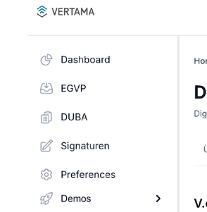
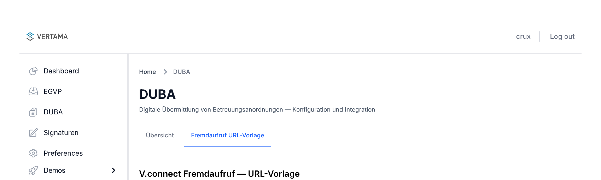
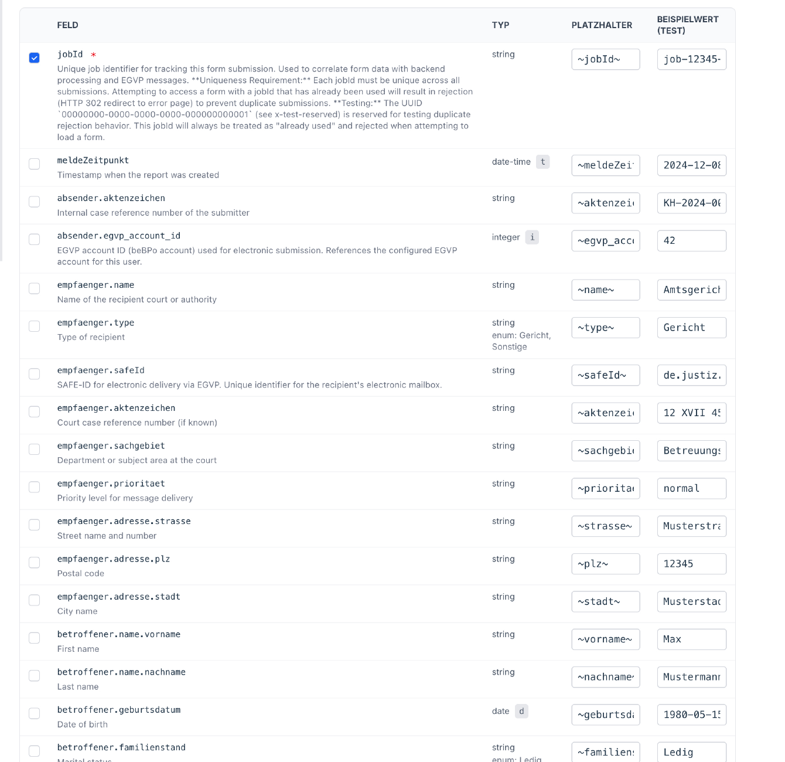
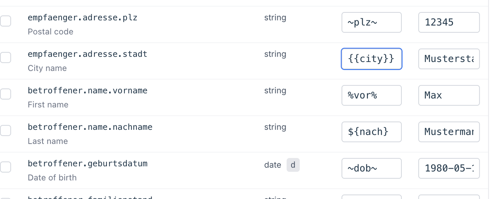
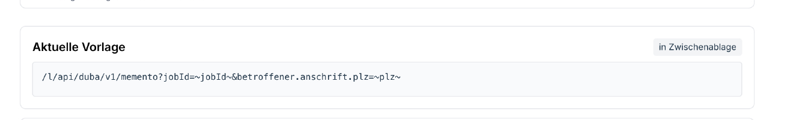
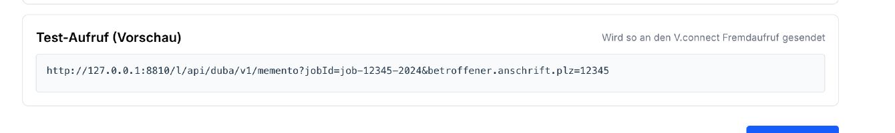
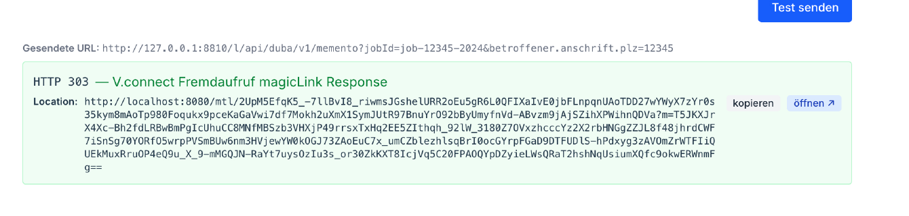

# V.connect Fremdaufruf — Benutzerhandbuch

Dieses Handbuch richtet sich an KIS-Integratoren, die ein Krankenhaus-
Informationssystem (KIS) an ein V.ap-Produktmodul (DUBA, ELIM+, …) anbinden
und dafür den **V.connect Fremdaufruf** einsetzen. Es beschreibt, wie Sie
mit dem URL-Vorlagen-Werkzeug in V.ap eine fertige Aufruf-URL erzeugen, sie
testen und in Ihrem KIS hinterlegen.

Die Beispiele in diesem Handbuch verwenden durchgehend das Modul **DUBA**.
Das Werkzeug arbeitet jedoch modul-unabhängig — die Schritte sind für
ELIM+, DIVI und weitere Module identisch.

## Inhaltsverzeichnis

- [1. Was ist der V.connect Fremdaufruf?](#1-was-ist-der-vconnect-fremdaufruf)
- [2. Voraussetzungen](#2-voraussetzungen)
- [3. Schritt für Schritt: URL-Vorlage erstellen](#3-schritt-fur-schritt-url-vorlage-erstellen)
    - [3.1 Modulseite öffnen](#31-modulseite-offnen)
    - [3.2 Felder auswählen](#32-felder-auswahlen)
    - [3.3 Platzhalter eintragen](#33-platzhalter-eintragen)
    - [3.4 Vorlage kopieren](#34-vorlage-kopieren)
- [4. URL-Codierung — Wer codiert wann?](#4-url-codierung-wer-codiert-wann)
- [5. Live-Test mit Beispielwerten](#5-live-test-mit-beispielwerten)
- [6. Im KIS hinterlegen](#6-im-kis-hinterlegen)
- [7. Fehlersuche](#7-fehlersuche)
- [8. Weiterführende Dokumente](#8-weiterfuhrende-dokumente)
- [Anhang: Aufbau der erzeugten URL](#anhang-aufbau-der-erzeugten-url)

---

## 1. Was ist der V.connect Fremdaufruf?

V.ap-Produktmodule (DUBA, ELIM+, …) bieten POST-Endpunkte an, die strukturierte
JSON-Daten entgegennehmen und mit einem **magicLink** antworten — einer
authentifizierten Einmal-URL, die in einem Browser geöffnet wird und ein
vorausgefülltes Formular anzeigt.

Manche KIS-Systeme können jedoch keine POST-Anfragen ausführen oder keinen
JSON-Body senden. Sie verfügen nur über das Primitiv "Öffne diese externe URL,
hänge folgende Parameter an die Query-String an". Das ist die Lücke, die der
**V.connect Fremdaufruf** schließt:

1. Das KIS öffnet eine GET-URL gegen den V.connect Fremdaufruf, der lokal auf
   dem Arbeitsplatzrechner läuft (üblicherweise `http://127.0.0.1:8810`).
2. Der V.connect Fremdaufruf wandelt die GET-Anfrage in eine
   authentifizierte POST-Anfrage gegen V.ap um.
3. V.ap antwortet mit dem magicLink, der V.connect Fremdaufruf leitet den
   Browser per HTTP 303 dorthin weiter.
4. Der Browser öffnet das vorausgefüllte Formular — der Anwender sieht
   keinen Unterschied zur direkten POST-Integration.

Die Aufruf-URL enthält keine sensiblen Daten im Klartext im Internet:
Patient*innen-Daten verlassen den Krankenhaus-Arbeitsplatz nur verschlüsselt
über die POST-Verbindung des Fremdaufrufs zu V.ap.

Eine ausführliche Architektur-Erklärung finden Sie im
[Solution Outline](overview.md).

---

## 2. Voraussetzungen

Bevor Sie mit dem URL-Vorlagen-Werkzeug arbeiten, sollten folgende
Voraussetzungen erfüllt sein:

| Komponente | Was Sie brauchen |
|------------|------------------|
| **V.ap-Zugang** | Ein gültiger API-User mit Berechtigung für das Zielmodul (z.&nbsp;B. DUBA). |
| **V.connect Fremdaufruf** | Installiert und gestartet auf dem KIS-Arbeitsplatz. Standardmäßig auf `http://127.0.0.1:8810` erreichbar. |
| **KIS-Konfiguration** | Berechtigung, im KIS einen "Externer Aufruf"-Eintrag mit Platzhaltern anzulegen. Die genaue Syntax hängt vom KIS ab. |
| **Browser** | Aktueller Browser am Arbeitsplatz, der vom V.connect Fremdaufruf zurückgegebene 303-Antworten verfolgt (alle gängigen Browser tun dies). |

---

## 3. Schritt für Schritt: URL-Vorlage erstellen

### 3.1 Modulseite öffnen

1. Melden Sie sich an V.ap an.
2. Wählen Sie in der Seitennavigation das Modul, für das Sie die Integration
   einrichten möchten — im Beispiel: **DUBA**.

   

3. Wechseln Sie auf den Reiter **Fremdaufruf URL-Vorlage**.

   

Sie sehen nun eine Tabelle mit allen Feldern, die das Modul akzeptiert. Jedes
Feld ist eine Zeile mit den Spalten *Feld*, *Typ*, *Platzhalter* und
*Beispielwert*.

### 3.2 Felder auswählen

Pflichtfelder sind standardmäßig vorausgewählt (Häkchen gesetzt, Feldname
mit `*` markiert). Optionale Felder fügen Sie hinzu, indem Sie das Häkchen
in der ersten Spalte setzen.

Im DUBA-Beispiel ist `jobId` das einzige Pflichtfeld. Häufig zusätzlich
benötigt:

- `betroffener.name.vorname` und `betroffener.name.nachname`
- `betroffener.geburtsdatum`
- `betroffener.anschrift.strasse`, `.plz`, `.stadt`
- `empfaenger.name`, `empfaenger.safeId`, `empfaenger.aktenzeichen`



### 3.3 Platzhalter eintragen

Platzhalter sind Marker, die Ihr KIS später durch echte Werte ersetzt. Der
V.connect Fremdaufruf gibt keine Syntax vor — wählen Sie die Schreibweise,
die Ihr KIS bei Textersetzung erkennt. Übliche Varianten:

| KIS-Beispiel | Platzhalter-Form |
|--------------|------------------|
| Tilden | `~feldname~` |
| Prozent | `%feldname%` |
| Doppelte Bindestriche | `--feldname--` |
| Geschweifte Klammern | `{feldname}` |
| Dollar/Klammern | `${feldname}` |

Das Werkzeug kopiert den eingetragenen Text **wortwörtlich** in die URL.
Wenn Sie z.&nbsp;B. `%PatientID%` eintragen, taucht in der URL der String
`%PatientID%` auf — und Ihr KIS muss zur Laufzeit `%PatientID%` durch
den tatsächlichen Wert ersetzen.

Die Spalte **Platzhalter** ist mit einem Vorschlag in `~feldname~`-Syntax
vorbelegt. Ersetzen Sie diesen Vorschlag durch die in Ihrem KIS gebräuchliche
Schreibweise.



> **Wichtig:** Platzhalter werden buchstäblich in die URL übernommen — der
> V.connect Fremdaufruf und V.ap interpretieren sie nicht. Das KIS ersetzt
> sie zur Laufzeit durch echte Werte, bevor die URL aufgerufen wird.

Die "Aktuelle Vorlage" unter der Tabelle aktualisiert sich bei jeder
Änderung automatisch. Was Sie dort sehen, ist genau die URL, die Sie
später in Ihr KIS kopieren.

### 3.4 Vorlage kopieren

Wenn die URL Ihrem Wunsch entspricht:

1. Prüfen Sie das Feld **V.connect Fremdaufruf Instanz URL** unter der
   Tabelle — dessen Wert bildet den Host-Anteil (grau dargestellt) am
   Anfang der Aktuelle Vorlage. Standard: `http://127.0.0.1:8810`. Ändern
   Sie ihn, falls Ihr KIS-Arbeitsplatz den V.connect Fremdaufruf auf einer
   anderen Adresse erreicht.
2. Klicken Sie auf **in Zwischenablage**.
3. Hinterlegen Sie die URL im Konfigurationsdialog Ihres KIS für externe
   Aufrufe (siehe [Abschnitt 6](#6-im-kis-hinterlegen)).



> Wenn Sie wissen möchten, was die einzelnen URL-Bestandteile (`/l/`, `_a`,
> `_t` …) bedeuten, finden Sie eine Erklärung im
> [Anhang](#anhang-aufbau-der-erzeugten-url).

---

## 4. URL-Codierung — Wer codiert wann?

Zwei Codier-Ebenen sind im Spiel — wichtig, um Verwirrung zu vermeiden:

**Platzhalter werden _nicht_ codiert.** Der Text `~dob~` oder `%PatientID%`
erscheint genau so in der Vorlage. Das ist nötig, damit Ihr KIS die
Platzhalter überhaupt erkennt. Würde V.ap z.&nbsp;B. `%` als `%25`
codieren, fände das KIS seinen `%PatientID%`-Platzhalter nicht mehr.

**Echte Werte muss das KIS zur Laufzeit codieren.** Wenn das KIS
`%PatientID%` durch z.&nbsp;B. `12345` ersetzt, ist das unproblematisch.
Wenn es jedoch durch `Müller & Sohn` oder eine Adresse mit Leerzeichen
ersetzt, muss das KIS diese Zeichen URL-codieren (`%20` für Leerzeichen,
`%26` für `&`, `%C3%BC` für `ü` usw.).

Die meisten KIS-Systeme bieten diese Codier-Funktion an — prüfen Sie die
Dokumentation Ihres KIS. Wenn nicht, müssen Sie sicherstellen, dass die
zu ersetzenden Werte aus dem KIS-Datenbestand keine zu codierenden
Sonderzeichen enthalten.

Der Live-Test im Werkzeug (siehe [Abschnitt 5](#5-live-test-mit-beispielwerten))
übernimmt das KIS-Verhalten und codiert die Beispielwerte automatisch — so
können Sie sicher sein, dass die Übertragung zum V.connect Fremdaufruf
korrekt funktioniert, wenn die Beispielwerte realistisch gewählt sind.

---

## 5. Live-Test mit Beispielwerten

Bevor Sie die Vorlage in Ihr KIS übertragen, sollten Sie sie gegen Ihre
laufende lokale V.connect-Fremdaufruf-Instanz testen. Dazu dient die
Spalte **Beispielwert (Test)** und der Bereich **Test-Aufruf (Vorschau)**.

1. Stellen Sie sicher, dass im Feld **V.connect Fremdaufruf Instanz URL**
   die richtige Adresse Ihrer lokal laufenden Instanz steht (Standard:
   `http://127.0.0.1:8810`).
2. Tragen Sie in der Spalte **Beispielwert (Test)** echte Beispieldaten ein
   — Geburtsdatum, Aktenzeichen, Anschriftsdaten. Die Vorschau "Test-Aufruf
   (Vorschau)" aktualisiert sich live; sie zeigt die URL exakt so, wie sie
   abgeschickt wird.

   

3. Klicken Sie auf **Test senden**.

Das Ergebnis erscheint unterhalb des Buttons:

- **HTTP 303** (grün) — Erfolgsfall. Der V.connect Fremdaufruf hat einen
  magicLink von V.ap erhalten. Der vollständige Link steht im Feld
  *Location*; Sie können ihn entweder
  - per **öffnen ↗** in einem neuen Tab aufrufen und prüfen, ob das
    Formular korrekt vorausgefüllt erscheint, oder
  - per **kopieren** in die Zwischenablage übernehmen.
- **HTTP 400** (gelb) — Wertprobleme. Lesen Sie die Antwort: meist
  fehlerhaftes Datumsformat oder ein abgelehnter Wert.
- **HTTP 422** (gelb) — V.ap hat die Daten validiert und Fehler gefunden.
  Die Antwort enthält die genauen Validierungsmeldungen.
- **HTTP 502 / Netzwerkfehler** — Der V.connect Fremdaufruf ist nicht
  erreichbar oder die Anmeldedaten gegen V.ap sind falsch. Siehe
  [Abschnitt 7](#7-fehlersuche).



> **Hinweis:** Der Test verwendet die *Beispielwerte*, nicht die Platzhalter.
> Beide Spalten sind unabhängig — Sie können testen, ohne die endgültige
> KIS-Syntax bereits eingetragen zu haben.

---

## 6. Im KIS hinterlegen

Das Konfigurations-Verfahren ist KIS-spezifisch. Konsultieren Sie die
Dokumentation Ihres KIS-Herstellers für Details. Allgemein laufen die
Schritte so ab:

1. Öffnen Sie im KIS die Konfiguration für externe Aufrufe oder
   Patienten-Kontext-Aktionen.
2. Erstellen Sie einen neuen Eintrag mit einem Anzeigenamen, z.&nbsp;B.
   *"Vertama DUBA — Meldung"*.
3. Fügen Sie die kopierte Vorlagen-URL als Ziel-URL ein.
4. Hinterlegen Sie die Platzhalter-Definitionen — also welcher Platzhalter
   (`~vorname~`, `~plz~`, …) durch welches KIS-Datenfeld ersetzt werden soll.
5. Speichern Sie die Konfiguration und testen Sie aus dem KIS heraus mit
   einem Test-Patientendatensatz.

Nach erfolgreicher Einrichtung sollten KIS-Anwender den Aufruf aus dem
Patientenkontext auslösen können und direkt im vorausgefüllten Formular
in V.ap landen.

---

## 7. Fehlersuche

| Symptom | Mögliche Ursache & Maßnahme |
|---------|------------------------------|
| **Test-Button → Netzwerkfehler** | Der V.connect Fremdaufruf läuft nicht oder bindet auf einer anderen Adresse. Prüfen Sie den lokalen Dienst (`Get-Service` unter Windows; `systemctl status` unter Linux) und die Komponenten-URL im Feld. |
| **Test-Button → HTTP 502, Body "upstream_auth_failed"** | Die im V.connect Fremdaufruf hinterlegten V.ap-API-Zugangsdaten sind falsch. Überprüfen Sie die `config.toml` des Dienstes. |
| **Test-Button → HTTP 400, "coercion_failed"** | Ein typisierter Wert (Datum, Boolean) liegt im falschen Format vor. Bei `format: date` ist `YYYY-MM-DD` Pflicht. Welche URL-Parameter typisiert sind, erläutert der [Anhang](#anhang-aufbau-der-erzeugten-url). |
| **Test-Button → HTTP 422** | V.ap lehnt die Daten als unvollständig oder ungültig ab. Die Antwort enthält die genauen Feldfehler. |
| **Aus dem KIS keine Antwort** | Das KIS löst die Platzhalter nicht oder codiert die Werte fehlerhaft. Verfolgen Sie den vom KIS tatsächlich abgesetzten Aufruf (z.&nbsp;B. mit dem Browser-Entwicklertool). |
| **Formular wird geöffnet, ist aber leer** | Pflichtfelder fehlen oder Platzhalter werden vom KIS nicht ersetzt. Beispielwerte im Werkzeug abgleichen. |

Für tiefergehende Diagnose lesen Sie das Audit-Log des V.connect
Fremdaufrufs. Die Protokoll-Einträge enthalten Pfad,
Parameter-Anzahl und HTTP-Statuscode — Werte werden aus
Datenschutzgründen nie protokolliert. Den Standardpfad und die
Konfiguration des Audit-Logs entnehmen Sie dem Betriebshandbuch,
das mit der Komponente ausgeliefert wird.

---

## 8. Weiterführende Dokumente

- [Overview](overview.md) — Architektur, Designentscheidungen, Sicherheitsaspekte
- **Betriebshandbuch** — Installation, Konfiguration und Betrieb auf dem KIS-Arbeitsplatz. Wird mit der Komponente ausgeliefert und ist nach der Installation über das Admin-Dashboard erreichbar; Vertama stellt es auf Anfrage vor der Bereitstellung zur Verfügung.
- Modul-spezifische API-Tutorials: [DUBA](../../../Products/DUBA/api-tutorial.md), [ELIM+](../../../Products/ELIMPLUS/integration-guide.md)

---

## Anhang: Aufbau der erzeugten URL

Dieser Anhang erklärt die einzelnen Bestandteile einer von V.ap erzeugten
Aufruf-URL. Für die tägliche Anwendung des Werkzeugs ist das nicht
erforderlich — die URL können Sie unverändert in Ihr KIS übernehmen. Diese
Information hilft jedoch beim Debugging und beim Verständnis der
Validierungsmeldungen.

Ein DUBA-Beispiel mit Standard-Platzhalter-Syntax:

```
http://127.0.0.1:8810/l/api/duba/v1/memento
   ?_a=b:betroffener,a:anschrift,n:name
   &_t=b.geburtsdatum:d
   &jobId=~jobId~
   &b.n.vorname=~vorname~
   &b.n.nachname=~nachname~
   &b.geburtsdatum=~geburtsdatum~
   &b.a.strasse=~strasse~
   &b.a.plz=~plz~
   &b.a.stadt=~stadt~
```

Aus Lesbarkeitsgründen über mehrere Zeilen dargestellt; in der Vorlage steht
alles in einer Zeile.

| Bestandteil | Bedeutung |
|-------------|-----------|
| `http://127.0.0.1:8810` | Host des V.connect Fremdaufrufs. Kommt aus dem Feld *V.connect Fremdaufruf Instanz URL*. |
| `/l/` | Fester Präfix. Markiert die Anfrage als Fremdaufruf. |
| `api/duba/v1/memento` | Der V.ap-Endpunkt, an den die Anfrage weitergeleitet wird. Wird vom Werkzeug automatisch passend zum gewählten Modul gesetzt. |
| `_a=…` | Alias-Tabelle, die häufige Pfad-Segmente abkürzt. Hier: `b`→`betroffener`, `a`→`anschrift`, `n`→`name`. Verkürzt die URL bei tief verschachtelten Feldern, ohne den Inhalt zu verändern. |
| `_t=…` | Typ-Manifest. Markiert, welche Felder kein String sind (`d`=Datum, `t`=Datum-Uhrzeit, `b`=Boolean, `i`=Integer, `n`=Number). Strings werden nicht aufgeführt. |
| `b.n.vorname=…` | Datenfeld. Nach Anwendung der Aliases entspricht dies dem JSON-Pfad `betroffener.name.vorname`. |

---

**Stand:** Mai 2026
**Geltungsbereich:** V.connect Fremdaufruf V1, V.ap-Modul DUBA und kompatible Module
