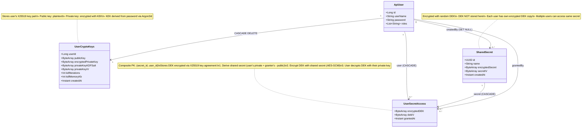

# Multi-User Secret Sharing - Implementation Notes

> **Audience**: Developers working on or extending this implementation
> **Companion to**: [Multi-User Secret Sharing with Zero-Knowledge Architecture.md](Multi-User%20Secret%20Sharing%20with%20Zero-Knowledge%20Architecture.md)

This document captures practical implementation details, gotchas, and lessons learned that aren't covered in the architectural design document.

---

## Table of Contents

1. [JPA/Hibernate Considerations](#jpahibernate-considerations)
2. [Testing Strategy](#testing-strategy)
3. [Common Pitfalls](#common-pitfalls)
4. [Performance Tips](#performance-tips)
5. [Memory Management](#memory-management)

---

## Entity Classes Diagram



### Cascade Delete Behavior

**When an ApiUser is deleted:**
1. **UserCryptoKeys**: Deleted via JPA `@OneToOne(cascade = CascadeType.REMOVE)` (application-level)
2. **UserSecretAccess** (where user had access): Deleted via database FK `ON DELETE CASCADE` (`@OnDelete(CASCADE)`)
3. **SharedSecret** (created by user): `createdBy` set to NULL via database FK `ON DELETE SET NULL` (`@OnDelete(SET_NULL)`)
   - Secret remains in database
   - Becomes orphaned but still accessible to other users who have access

**When a SharedSecret is deleted:**
- **UserSecretAccess** records: Deleted via database FK `ON DELETE CASCADE`

**Why mixed cascade strategy?**
- **JPA cascade** for `UserCryptoKeys`: Simple 1:1 relationship, no circular references
- **Database cascade** for `UserSecretAccess`: Avoids Hibernate circular reference issues when deleting through complex relationship graph
- **Database SET NULL** for `SharedSecret.createdBy`: Allows secrets to outlive their creator

---

## JPA/Hibernate Considerations

### Entity Design: Immutable Data Classes

All entities use Kotlin `data class` with `val` (immutable) fields for thread safety and functional programming benefits.

```kotlin
@Entity
data class UserCryptoKeys(
    @Id val userId: Long,
    val publicKey: ByteArray,
    val encryptedPrivateKey: ByteArray,
    // ... immutable fields
    @Version var version: Long? = null  // MUST be var!
)
```

**Why immutable?**
- Crypto keys shouldn't be accidentally modified
- Thread-safe
- Better functional programming semantics

**The `@Version` requirement:**

When using immutable fields with `.copy()`, you MUST add a `@Version` field:

```kotlin
// Without @Version: FAILS
val keys = repo.findById(userId).orElseThrow()
val updated = keys.copy(encryptedPrivateKey = newKey)
repo.save(updated)  // 💥 StaleObjectStateException

// With @Version: WORKS
@Version var version: Long? = null  // In entity
```

**Why?**
- `.copy()` creates a **detached** entity (new object instance)
- Hibernate can't tell if it's safe to merge without version tracking
- `@Version` enables optimistic locking and safe merging
- Bonus: Prevents lost updates during concurrent modifications

See: [Hibernate Optimistic Locking](https://docs.jboss.org/hibernate/orm/6.2/userguide/html_single/Hibernate_User_Guide.html#locking-optimistic)

### OneToOne Relationships Without `@MapsId`

Initial attempt used `@MapsId` but it requires the relationship to be non-null during persist:

```kotlin
// ❌ FAILS - @MapsId requires user to be non-null
@OneToOne
@MapsId
@JoinColumn(name = "user_id")
val user: ApiUser? = null
```

**Solution**: Use manual ID + read-only relationship:

```kotlin
// ✅ WORKS
@Id
val userId: Long,  // Manual ID

@OneToOne
@JoinColumn(name = "user_id", insertable = false, updatable = false)
val user: ApiUser? = null  // Read-only navigation property
```

**How it works:**
- `userId` is the PK and FK (same value)
- `user` is just for navigation (lazy-loaded when accessed)
- `insertable/updatable = false` prevents cascade issues
- No detached entity problems!

### Delete Methods Need Annotations

Spring Data JPA delete methods require both `@Modifying` and `@Transactional`:

```kotlin
interface UserSecretAccessRepository : JpaRepository<...> {

    @Modifying
    @Transactional
    fun deleteBySecretIdAndUserId(secretId: UUID, userId: Long)
}
```

**Why?**
- `@Modifying`: Marks method as data-modifying operation
- `@Transactional`: Ensures EntityManager has active transaction
- Without them: `TransactionRequiredException`

### ByteArray Equality

JPA entities with `ByteArray` fields need custom `equals()`/`hashCode()`:

```kotlin
@Entity
data class UserCryptoKeys(...) {
    override fun equals(other: Any?): Boolean {
        if (this === other) return true
        if (javaClass != other?.javaClass) return false
        other as UserCryptoKeys
        return userId == other.userId  // ID-based equality
    }

    override fun hashCode(): Int = userId.hashCode()
}
```

**Why?**
- `ByteArray.equals()` checks reference equality, not content
- Data class default `equals()` breaks for byte arrays
- Solution: ID-based equality for entities

---

## Testing Strategy

### Two-Tier Approach: Unit + Integration

We maintain both test types for different purposes:

#### Unit Tests (`ServiceTest.kt`)
- **Purpose**: Fast, isolated, test logic only
- **Uses**: Mockito mocks for all repositories
- **Speed**: ~2-3 seconds for full suite
- **KDF params**: `iterations=1, memory=1MB` (100x faster)
- **Best for**: Regression testing, CI/CD

**Key pattern**: Real crypto operations, mocked persistence:

```kotlin
@BeforeAll
fun setup() {
    userKeysRepo = Mockito.mock(UserCryptoKeysRepository::class.java)
    service = Service(
        userKeysRepo = userKeysRepo,
        // ... other mocks
        kdfIterations = 1,      // Fast KDF
        kdfMemoryKb = 1024
    )
}
```

#### Integration Tests (`ServiceIntegrationTest.kt`)
- **Purpose**: Test real database interactions
- **Uses**: Real PostgreSQL via Testcontainers
- **Speed**: ~10-15 seconds (includes DB startup)
- **KDF params**: Uses service defaults
- **Best for**: Catching JPA/Hibernate issues, manual verification

**Key pattern**: No mocks, real Spring context:

```kotlin
@SpringBootTest
class ServiceIntegrationTest : IntegrationTest() {
    @Autowired private lateinit var service: Service
    @Autowired private lateinit var userKeysRepo: UserCryptoKeysRepository
    // Real dependencies injected by Spring
}
```

### Test Helpers: Cache vs Capture

**Unit tests**: Use `thenAnswer {}` to track saves in maps:

```kotlin
private val userKeysCache = mutableMapOf<Long, UserCryptoKeys>()

Mockito.`when`(userKeysRepo.save(any())).thenAnswer { invocation ->
    val keys = invocation.arguments[0] as UserCryptoKeys
    userKeysCache[keys.userId] = keys  // Track in map
    keys
}

// Dynamic lookup (survives password rotation)
Mockito.`when`(userKeysRepo.findById(userId)).thenAnswer {
    Optional.ofNullable(userKeysCache[userId])  // Always current
}
```

**Why `thenAnswer {}` instead of `thenReturn()`?**
- `thenReturn()` captures value at stub-creation time
- `thenAnswer {}` evaluates dynamically on each call
- Needed for password rotation where keys change

**Integration tests**: Just use real repositories, no helpers needed!

### Debugging Transaction Issues

Common error: `No EntityManager with actual transaction available`

**Cause**: Delete/modify operations without `@Transactional`
**Solution**: Add `@Transactional` to repository method or service method

---

## Common Pitfalls

### 1. Mixing Test KDF Parameters

❌ **Wrong**:
```kotlin
setupMockUserKeys(user, password = "pass1")  // Uses KDF defaults
service.createSecret(userId, password = "pass1")  // Uses test KDF
// Result: Wrong password error!
```

✅ **Right**: Ensure consistent KDF parameters throughout test lifecycle.

### 2. Password Mismatches in Test Helpers

```kotlin
// Helper should accept password
private fun createMockSecret(
    user: ApiUser,
    value: String,
    password: String = "password"  // Default for convenience
): UUID
```

### 3. Forgetting to Clear Sensitive Data

❌ **Wrong**:
```kotlin
val kek = deriveKey(password, salt)
val decrypted = decrypt(data, kek)
return decrypted  // KEK still in memory!
```

✅ **Right**:
```kotlin
val kek = deriveKey(password, salt)
try {
    return decrypt(data, kek)
} finally {
    kek.fill(0)  // Always clear
}
```

### 4. Assuming `ApiUser` is Available

The `UserCryptoKeys.user` field is often `null` after creation (lazy-loaded). Don't rely on it:

```kotlin
// ❌ May be null
val user = userKeys.user!!  // NPE risk

// ✅ Use userId instead
val userId = userKeys.userId
val user = apiUserRepo.findById(userId).orElseThrow()
```

---

## Performance Tips

### KDF Parameters Tuning

Test on your target hardware:

```kotlin
fun measureKDF() {
    val params = listOf(
        Pair(1, 1024),      // ~10ms (testing only!)
        Pair(2, 4096),      // ~50ms
        Pair(3, 65536),     // ~200ms (default)
        Pair(4, 65536)      // ~300ms
    )

    params.forEach { (iter, mem) ->
        val start = System.currentTimeMillis()
        Argon2id.derive(password, salt, iter, mem)
        println("Iterations=$iter, Memory=${mem}KB: ${System.currentTimeMillis() - start}ms")
    }
}
```

**Target**: 100-500ms per KDF operation
- Too fast: Weak against brute-force
- Too slow: Poor UX

### Caching Strategies

**Cache**:
- ✅ Public keys (rarely change)
- ✅ Encrypted data (safe to cache)

**Never cache**:
- ❌ Passwords
- ❌ KEKs (derived keys)
- ❌ Decrypted private keys
- ❌ DEKs
- ❌ Plaintext secrets

### Database Indexes

```sql
-- Required indexes
CREATE INDEX idx_user_secret_access_secret ON user_secret_access(secret_id);
CREATE INDEX idx_user_secret_access_user ON user_secret_access(user_id);
CREATE INDEX idx_shared_secret_created_by ON shared_secret(created_by);

-- Composite for common query
CREATE INDEX idx_user_secret_access_lookup
  ON user_secret_access(secret_id, user_id);
```

---

## Memory Management

### Sensitive Data Lifecycle

```kotlin
// 1. Create/derive
val key = deriveKey(password, salt)

// 2. Use
val result = encrypt(data, key)

// 3. ALWAYS clear
try {
    // Use key
} finally {
    key.fill(0)           // ByteArray
    privateKey.destroy()   // Key interface
}
```

### Verify Clearing (Testing)

```kotlin
@Test
fun `should clear sensitive data after use`() {
    val password = "test-password"
    val service = spy(Service(...))

    service.accessSecret(userId, password, secretId)

    // Verify no keys remain in heap dumps
    // (Manual inspection or memory profiler)
}
```

**Note**: Can't easily unit-test memory clearing, but code review + manual verification is important.

---

## Migration Path

### Adding to Existing Application

1. **Create tables** (Hibernate auto-DDL or Flyway):
```sql
CREATE TABLE user_crypto_keys (...);
CREATE TABLE shared_secret (...);
CREATE TABLE user_secret_access (...);
```

2. **Optional: Migrate existing secrets**:
```kotlin
fun migrateExistingSecrets() {
    existingSecrets.forEach { secret ->
        // Generate DEK, re-encrypt secret
        // Encrypt DEK with each user's public key
        // Store in new schema
    }
}
```

3. **Gradual rollout**:
   - Phase 1: New users only
   - Phase 2: Existing users opt-in
   - Phase 3: Force migration

---

## Troubleshooting

### Error: "attempted to assign id from null one-to-one property"

**Cause**: Using `@MapsId` with null relationship
**Fix**: Remove `@MapsId`, use manual ID management

### Error: "detached entity passed to persist"

**Cause**: Trying to save entity with detached relationship
**Fix**: Add `insertable=false, updatable=false` to `@JoinColumn`

### Error: "Row was updated or deleted by another transaction"

**Cause**: Missing `@Version` field for immutable entity updates
**Fix**: Add `@Version var version: Long? = null`

### Error: "Tag mismatch" during decryption

**Cause**: Wrong password or corrupted data
**Solution**: Check password, verify KDF parameters match

### Error: "No EntityManager with actual transaction"

**Cause**: Delete method without `@Transactional`
**Fix**: Add `@Modifying` + `@Transactional` to repository method

---

## Code Review Checklist

When reviewing secret sharing code:

- [ ] All sensitive byte arrays cleared with `.fill(0)`
- [ ] Keys destroyed with `.destroy()` after use
- [ ] Try-finally blocks protect key lifecycle
- [ ] No passwords logged or stored
- [ ] KDF parameters appropriate for environment
- [ ] Test KDF parameters only in test code
- [ ] Entity has `@Version` if using `.copy()`
- [ ] Delete methods have `@Modifying` + `@Transactional`
- [ ] ByteArray entities override `equals()`/`hashCode()`
- [ ] Integration tests cover transaction boundaries

---

**Document Version**: 1.0
**Last Updated**: 2025-10-14
**Related**: [Multi-User Secret Sharing with Zero-Knowledge Architecture.md](Multi-User%20Secret%20Sharing%20with%20Zero-Knowledge%20Architecture.md)
